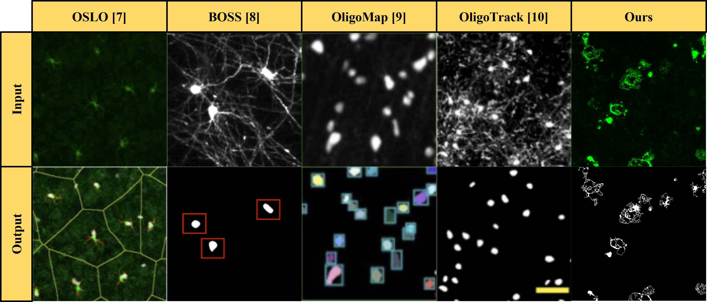
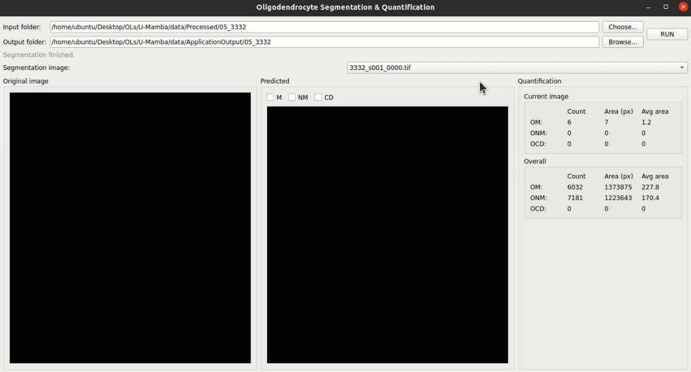

# AI-Based Morphological Segmentation of Oligodendrocyte Myelin Plasticity

> **⚠️ Note:** This repository contains the demonstration and performance benchmarks for a deep learning pipeline currently under review for publication. The full source code and trained weights will be released upon acceptance.

## 🔬 Project Overview

Quantifying oligodendrocyte (OL) morphology in high-throughput screens is a significant challenge due to the intricate, recursive branching of mature myelin sheaths. Traditional tools often rely on qualitative descriptors, convex shape assumptions [1, 7], or are designed for tubular structures [2, 9], failing to capture the "broken branch" topology of complex arbors.

This project introduces a minimal, auditable deep learning pipeline designed to convert pixel-level segmentations of whole-well MBP (Myelin Basic Protein) images into rigorous, well-level statistical endpoints.

**Key Capabilities:**
<!-- * **Granular Segmentation:** Distinguishes between **Membranous (sheaths)**, **Non-membranous (soma)**, and **Cell Debris**. -->
* **Topology-Aware Architecture:** Utilizes a modified U-Net [3] backbone augmented with spatial-channel squeeze-excitation (scSE) [4] and a Vision Transformer (ViT) bottleneck [5] to preserve fine branching structures.
* **Automated Quantification:** Aggregates object-level metrics to reveal biological maturation trends, specifically differentiating between sheath expansion and simple cell proliferation.

---

## 🖼️ Visual Results: What are we segmenting?

The primary challenge in segmenting mature oligodendrocytes is preserving the connectivity of thin, branching processes while isolating them from the cell body and background noise.

<!-- As shown below, our pipeline decomposes the fluorescent signal into three biologically distinct classes:
1.  **Membranous (Yellow):** The complex, branching myelin sheaths.
2.  **Non-membranous (Magenta):** The distinct, rounded cell soma.
3.  **Cell Debris (Cyan):** Apoptotic fragments or staining artifacts (excluded from analysis). -->

*(Figure: Comparison of segmentation fidelity.)*
<!-- *(Figure: Comparison of segmentation fidelity. The ViT-Modified model successfully reconstructs the continuous arbor (Yellow) where baseline models often produce fragmented artifacts.)* -->

---

## 🖥️ Application Demo

We have developed a GUI to facilitate the batch processing of high-content screening data. The application visualizes the segmentation mask and provides real-time quantification of component counts and areas.

---

## 📊 Performance Benchmarks

We benchmarked our proposed architectures (**scSE-Modified** and **ViT-Modified**) against standard baselines (Plain ConvUNet [3]) and state-of-the-art models (U-Mamba [6], Aura-net [8]).

Our **ViT-Modified** variant achieves the highest structural fidelity, particularly for the challenging "Membranous" class.

| Model | Params (M) | FLOPs (G) | Dice (%) | IoU (%) | Train (s/ep) |
| :--- | :---: | :---: | :---: | :---: | :---: |
| **Plain ConvUNet** [3] | 7.77 | 48.42 | 76.93 | 65.58 | 22 |
| **UMambaBot** [6] | 17.15 | 96.43 | 80.34 | 69.81 | 69 |
| **UMamba Enc** [6] | 11.38 | 94.56 | 81.21 | 70.47 | 98 |
| **scSE-Modified (Ours)** | 23.18 | 65.25 | 83.48 | 74.29 | 56 |
| **ViT-Modified (Ours)** | **39.76** | **66.32** | **89.43** | **83.77** | **57** |

*Table 1: Performance vs. Complexity comparison. The ViT-Modified architecture achieves a Dice score of 89.43% and IoU of 83.77% on held-out tiles.*

---

## 📅 Availability

**Contact:**
For questions regarding the dataset or methodology prior to publication, please reach out to the corresponding author.

---

## 📚 References

[1] Stringer, C., et al. (2020). Cellpose: a generalist algorithm for cellular segmentation. *Nature Methods*, 18(1):100-106.

[2] Zaimi, A., et al. (2017). AxonDeepSeg: Automatic axon and myelin segmentation from microscopy data using convolutional neural networks. *arXiv preprint arXiv:1711.01004*.

[3] Ronneberger, O., et al. (2015). U-Net: Convolutional networks for biomedical image segmentation. *MICCAI*, 234-241.

[4] Roy, A. G., et al. (2018). Concurrent spatial and channel 'squeeze & excitation' in fully convolutional networks. *arXiv preprint arXiv:1803.02579*.

[5] Chen, J., et al. (2021). TransUNet: Transformers make strong encoders for medical image segmentation. *arXiv preprint arXiv:2102.04306*.

[6] Ma, J., et al. (2024). U-Mamba: Enhancing long-range dependency for biomedical image segmentation. *arXiv preprint arXiv:2401.04722*.

[7] Yu Kang T. Xu, Cody L. Call, Jeremias Sulam, and Dwight E. Bergles. Automated in vivo tracking of cortical oligodendrocytes. *Frontiers in Cellular Neuroscience*, 15, 2021.

[8] Mohammed Saad, Fan Xu, Jing Li, and et al. Aura-net: Robust segmentation of phasecontrast microscopy images with few annotations. *IEEE Transactions on Biomedical Engineering*, 67(11):3095–3104, 2020.

[9] Mahdi Safaie and Reza Kheradmand. High-throughput segmentation of unmyelinated axons by deep learning. *IEEE Transactions on Medical Imaging*, 41(9):2047–2057, 2022.

[10] Yuxiang An, Dongnan Liu, and Weidong Cai. Unsupervised domain adaptation for neuron membrane segmentation based on structural features. *arXiv preprint arXiv:2305.02569*, 2023.